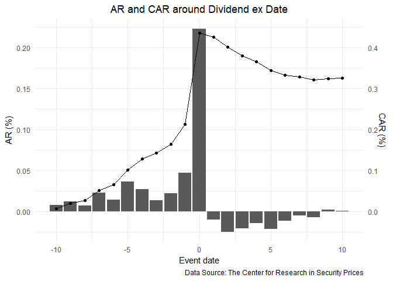
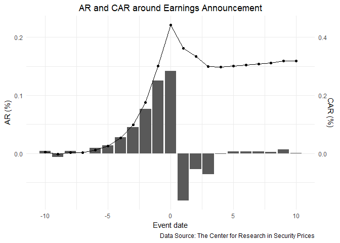

Event\_Studies
================
Jiaxi Li
June 2, 2019

-   [Data Cleaning and Variable Calculation](#data-cleaning-and-variable-calculation)
-   [The Dividend Event](#the-dividend-event)
-   [The Earnings Announcement Event](#the-earnings-announcement-event)
-   [Session info](#session-info)

Data Cleaning and Variable Calculation
======================================

I would first obtain the PERMNO's and returns and share outstandings from CRSP Monthly Stock from 1959 to 2018. The conditional statements are share code 10 or 11, exchange code from 1 to 3, number of shares outstanding is not null and holding period return is not null.

After extracting all the PERMNOs, I extract the book values for the stocks with the book value from the PERMNOs. The conditional Statement is Book value per Share is not null.

Caculate the size, book-to-market, and momemtum for each stocks. The book equity value is the book equity value from the most recent fiscal year. Here, I assume that each of the value is constant for a given month.

After defining the groups for each PERMNO/month, One needs to remember that when one uses lagged characteristics to find the matching portfolios.

Extract the Permnos again and use them to obtain the dividend ex date (not null; from CRSP/Compustat Merged Database - Security Daily) and earnings announcement date (not null; CRSP/Compustat Merged Database - Fundamentals Quarterly) and the daily returns (not null; CRSP Daily Stock)

Save all the daily Abnormal Returns and dividend and earnings announcement events into a data file PS2.csv

The Dividend Event
==================

It seems that there is a positive abnormal return for dividend event. The graph supports the findings of Hartzmark and Solomon (2013): "The premium is consistent with price pressure from dividend-seeking investors. Measures of liquidity and demand for dividends are associated with larger price increases in the period before the ex-day (when there is no news about the dividend), and larger reversals afterwards."

The Earnings Announcement Event
===============================

It seems that there is a positive abnormal return for earnings annoucement as well. The effect of positive Abnormal return is gradually increasing and there is no jump as dividend ex date. It seems market are updating information before the event. This confirms the claim by Frazzini and Lamont (2007): "On average, stock prices rise around scheduled earnings announcement dates. We show that this earnings announcement premium is large, robust, and strongly related to the fact that volume surges around announcement dates.""

Session info
============

    ## - Session info ----------------------------------------------------------
    ##  setting  value                       
    ##  version  R version 3.5.0 (2018-04-23)
    ##  os       Windows 10 x64              
    ##  system   x86_64, mingw32             
    ##  ui       RTerm                       
    ##  language (EN)                        
    ##  collate  English_United States.1252  
    ##  ctype    English_United States.1252  
    ##  tz       America/Chicago             
    ##  date     2019-06-03                  
    ## 
    ## - Packages --------------------------------------------------------------
    ##  package     * version date       lib source        
    ##  assertthat    0.2.1   2019-03-21 [1] CRAN (R 3.5.3)
    ##  backports     1.1.4   2019-04-10 [1] CRAN (R 3.5.3)
    ##  broom         0.5.2   2019-04-07 [1] CRAN (R 3.5.3)
    ##  callr         3.2.0   2019-03-15 [1] CRAN (R 3.5.3)
    ##  cellranger    1.1.0   2016-07-27 [1] CRAN (R 3.5.0)
    ##  cli           1.1.0   2019-03-19 [1] CRAN (R 3.5.3)
    ##  colorspace    1.4-1   2019-03-18 [1] CRAN (R 3.5.3)
    ##  crayon        1.3.4   2017-09-16 [1] CRAN (R 3.5.0)
    ##  desc          1.2.0   2018-05-01 [1] CRAN (R 3.5.3)
    ##  devtools      2.0.2   2019-04-08 [1] CRAN (R 3.5.3)
    ##  digest        0.6.18  2018-10-10 [1] CRAN (R 3.5.3)
    ##  dplyr       * 0.8.0.1 2019-02-15 [1] CRAN (R 3.5.3)
    ##  evaluate      0.13    2019-02-12 [1] CRAN (R 3.5.3)
    ##  forcats     * 0.4.0   2019-02-17 [1] CRAN (R 3.5.3)
    ##  fs            1.3.1   2019-05-06 [1] CRAN (R 3.5.3)
    ##  generics      0.0.2   2018-11-29 [1] CRAN (R 3.5.3)
    ##  ggplot2     * 3.1.1   2019-04-07 [1] CRAN (R 3.5.3)
    ##  glue          1.3.1   2019-03-12 [1] CRAN (R 3.5.3)
    ##  gtable        0.3.0   2019-03-25 [1] CRAN (R 3.5.3)
    ##  haven         2.1.0   2019-02-19 [1] CRAN (R 3.5.3)
    ##  here        * 0.1     2017-05-28 [1] CRAN (R 3.5.3)
    ##  hms           0.4.2   2018-03-10 [1] CRAN (R 3.5.1)
    ##  htmltools     0.3.6   2017-04-28 [1] CRAN (R 3.5.1)
    ##  httr          1.4.0   2018-12-11 [1] CRAN (R 3.5.3)
    ##  jsonlite      1.6     2018-12-07 [1] CRAN (R 3.5.3)
    ##  knitr         1.22    2019-03-08 [1] CRAN (R 3.5.3)
    ##  labeling      0.3     2014-08-23 [1] CRAN (R 3.5.0)
    ##  lattice       0.20-35 2017-03-25 [2] CRAN (R 3.5.0)
    ##  lazyeval      0.2.2   2019-03-15 [1] CRAN (R 3.5.3)
    ##  lubridate     1.7.4   2018-04-11 [1] CRAN (R 3.5.1)
    ##  magrittr      1.5     2014-11-22 [1] CRAN (R 3.5.1)
    ##  memoise       1.1.0   2017-04-21 [1] CRAN (R 3.5.3)
    ##  modelr        0.1.4   2019-02-18 [1] CRAN (R 3.5.3)
    ##  munsell       0.5.0   2018-06-12 [1] CRAN (R 3.5.1)
    ##  nlme          3.1-137 2018-04-07 [2] CRAN (R 3.5.0)
    ##  pillar        1.4.0   2019-05-11 [1] CRAN (R 3.5.0)
    ##  pkgbuild      1.0.3   2019-03-20 [1] CRAN (R 3.5.3)
    ##  pkgconfig     2.0.2   2018-08-16 [1] CRAN (R 3.5.1)
    ##  pkgload       1.0.2   2018-10-29 [1] CRAN (R 3.5.3)
    ##  plyr          1.8.4   2016-06-08 [1] CRAN (R 3.5.1)
    ##  prettyunits   1.0.2   2015-07-13 [1] CRAN (R 3.5.1)
    ##  processx      3.3.1   2019-05-08 [1] CRAN (R 3.5.3)
    ##  ps            1.3.0   2018-12-21 [1] CRAN (R 3.5.3)
    ##  purrr       * 0.3.2   2019-03-15 [1] CRAN (R 3.5.3)
    ##  R6            2.4.0   2019-02-14 [1] CRAN (R 3.5.3)
    ##  Rcpp          1.0.1   2019-03-17 [1] CRAN (R 3.5.3)
    ##  readr       * 1.3.1   2018-12-21 [1] CRAN (R 3.5.3)
    ##  readxl        1.3.1   2019-03-13 [1] CRAN (R 3.5.3)
    ##  remotes       2.0.4   2019-04-10 [1] CRAN (R 3.5.3)
    ##  rlang         0.3.4   2019-04-07 [1] CRAN (R 3.5.3)
    ##  rmarkdown     1.12    2019-03-14 [1] CRAN (R 3.5.3)
    ##  rprojroot     1.3-2   2018-01-03 [1] CRAN (R 3.5.1)
    ##  rstudioapi    0.10    2019-03-19 [1] CRAN (R 3.5.3)
    ##  rvest         0.3.3   2019-04-11 [1] CRAN (R 3.5.3)
    ##  scales        1.0.0   2018-08-09 [1] CRAN (R 3.5.1)
    ##  sessioninfo   1.1.1   2018-11-05 [1] CRAN (R 3.5.3)
    ##  stringi       1.4.3   2019-03-12 [1] CRAN (R 3.5.3)
    ##  stringr     * 1.4.0   2019-02-10 [1] CRAN (R 3.5.3)
    ##  tibble      * 2.1.1   2019-03-16 [1] CRAN (R 3.5.3)
    ##  tidyr       * 0.8.3   2019-03-01 [1] CRAN (R 3.5.3)
    ##  tidyselect    0.2.5   2018-10-11 [1] CRAN (R 3.5.1)
    ##  tidyverse   * 1.2.1   2017-11-14 [1] CRAN (R 3.5.3)
    ##  usethis       1.5.0   2019-04-07 [1] CRAN (R 3.5.3)
    ##  withr         2.1.2   2018-03-15 [1] CRAN (R 3.5.1)
    ##  xfun          0.6     2019-04-02 [1] CRAN (R 3.5.3)
    ##  xml2          1.2.0   2018-01-24 [1] CRAN (R 3.5.1)
    ##  yaml          2.2.0   2018-07-25 [1] CRAN (R 3.5.1)
    ## 
    ## [1] C:/Users/lijia/Documents/R/win-library/3.5
    ## [2] C:/Program Files/R/R-3.5.0/library
